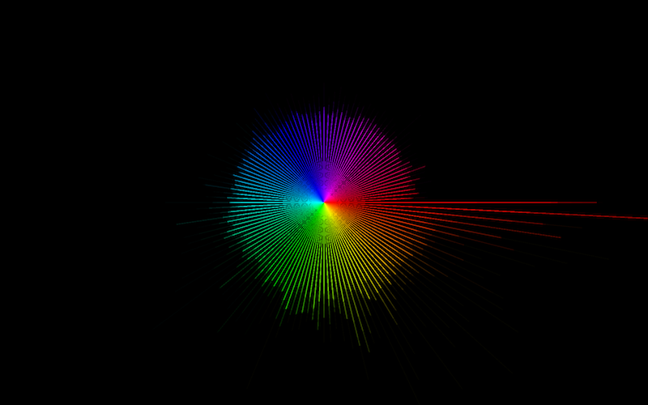

# RadiusBandVisualization
Another live audioband visualization - kinda modular.

This is a simple project I created after revisiting Processing inspired by [a talk](https://beyondtellerrand.com/events/duesseldorf-2018/speakers/jared-tarbell) of @jaredtarbell at [Beyond Tellerrand 2018](https://beyondtellerrand.com) in Düsseldorf.

